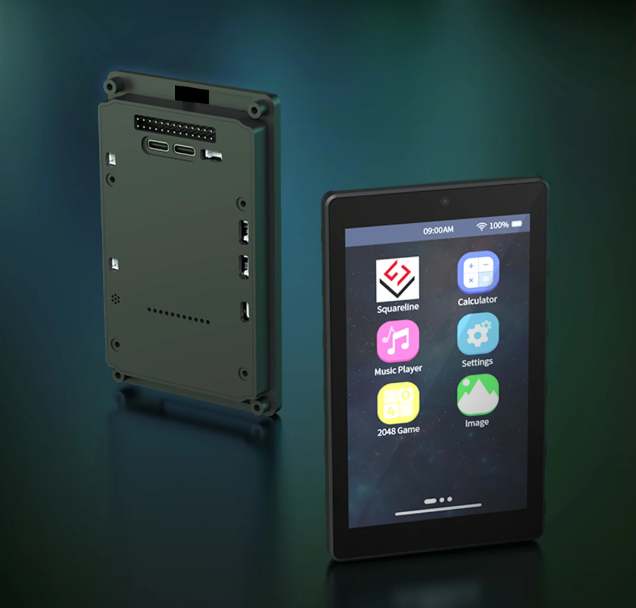

<div align="center">

# SonosESP

**A touchscreen Sonos controller for ESP32-P4.**

A wall-mount or desktop remote for Sonos speakers: album art, synced lyrics, full library browsing, multi-room control, weather and four screensaver clock faces — on a 4″ or 7″ panel, with over-the-air updates.

[](https://opensource.org/licenses/MIT)
[](https://platformio.org/)
[](https://github.com/OpenSurface/SonosESP/releases)
[](https://github.com/OpenSurface/SonosESP/releases/latest)
[](https://github.com/OpenSurface/SonosESP/stargazers)

### [Install in your browser — no toolchain required](https://opensurface.github.io/SonosESP/)

[Features](#features) · [Music sources](#music-sources) · [Themes](#player-themes) · [Screensaver](#screensaver-themes) · [Hardware](#hardware) · [Install](#installation) · [Setup](#first-time-setup) · [Troubleshooting](docs/TROUBLESHOOTING.md) · [Contributing](#contributing)

</div>

---


## Features

### Playback

- **Full transport control** — play and pause, skip, previous, shuffle, repeat, volume and mute
- **Complete library browsing** — every source the speaker exposes, not a fixed list. See [Music sources](#music-sources)
- **Multi-room** — switch between Sonos zones, with live indicators showing which rooms are playing
- **Speaker groups** — create and break groups from the panel
- **Line-in and TV audio** — dedicated screens when a soundbar is on TV input or a device is on analogue line-in

### Display

- **Album art** — ESP32-P4 hardware JPEG decoder, with PNG and progressive-JPEG support, bilinear scaling and automatic dominant-colour extraction
- **Synced lyrics** — time-synced from [LRCLIB](https://lrclib.net/), with auto-hide and colour matching
- **Accented characters throughout** — titles, artists, lyrics, menus, dropdowns and the on-screen keyboard all render Latin-1 and Latin Extended-A correctly (Beyoncé, Björk, Sigur Rós) rather than substituting plain letters
- **Three player themes** and **four screensaver faces** — see below
- **Weather** — current conditions and a 6-hour forecast from [Open-Meteo](https://open-meteo.com/), no API key
- **Auto-dim** — configurable idle timeout and dimmed brightness

### System

- **Two panel sizes, one codebase** — 4″ and 7″ build from the same source, with type and spacing scaling to the panel rather than being authored twice
- **OTA updates** — install new firmware from the panel, on Stable or Nightly channels, with resumable downloads
- **Browser installer** — flash over USB from Chrome, Edge or Opera; no toolchain required

## Music sources

The Sources screen lists what your household actually has. It is built by asking the
speaker at runtime rather than from a hardcoded list, so a system with no music
share does not show an empty Music Library, and a container Sonos adds in future
appears without a firmware update.

| Source | Contents |
|---|---|
| **Music Library** | Artists, album artists, albums, genres, composers, tracks and imported playlists from your network share |
| **Music Shares** | The SMB/NAS shares indexed by Sonos |
| **Sonos Playlists** | Saved queues |
| **Favorites** | Everything saved in the Sonos app, including streaming-service playlists and mixes |
| **Internet Radio** | Radio stations and radio shows |
| **Queue** | What is queued right now |
| **Line-In** | Analogue input, on players that have one |

Browsing supports arbitrary nesting with a back arrow and a breadcrumb showing where
you are, so a deep path like Music Library → Artists → an artist → an album stays
navigable. Long lists load in pages rather than truncating, so a 500-track queue is
fully reachable.

**Streaming services.** Content you have saved — favourites and playlists from
Spotify, Apple Music, YouTube Music and others — plays directly, because the speaker
resolves it with credentials it already holds. SonosESP never asks you to sign in to
anything. Searching a service's full catalogue is not supported; add what you want in
the Sonos app and it appears here.

## Player themes

Switch in **Settings → General → Theme**. Adding one is a single registry entry — see [`src/ui_theme.cpp`](src/ui_theme.cpp).

| Theme | Look |
|---|---|
| **SonosESP** *(default)* | The original: blurred album art fills the screen behind the player. The backdrop can be turned off in Display settings |
| **Ambient** | Backdrop tinted from the artwork, artwork left with lyrics beneath it, pill-shaped room selector |
| **Immersive** | Full-bleed colour, compact header, and a large animated lyric stage where each line fades in |

## Screensaver themes

The panel falls back to a clock after an idle timeout. Switch faces in
**Settings → Clock → Theme**; each supports the optional photo background and the
weather overlay. Adding one is a single registry entry — see
[`src/clock_face.cpp`](src/clock_face.cpp).

| Theme | Look |
|---|---|
| **Horizon** *(default)* | Centred clock over an ambient glow, one-line weather summary, 6-hour forecast as pill chips |
| **Orbit** | Clock alongside a live sun-path arc tracking real sunrise and sunset, forecast drawn as a temperature curve |
| **Monolith** | Hours stacked over minutes, a details column for humidity, wind, UV and sun times, and a forecast rail |
| **StandBy** | Oversized overlapping digits tinted from the current album art |

Touch the screen at any time to return to the player.

## Hardware

SonosESP runs on **GUITION ESP32-P4 + ESP32-C6 touchscreen boards**. Both panel sizes
build from the same codebase, and the installer and OTA select the right image
automatically (`firmware-4inch.bin` / `firmware-7inch.bin`).



| | **4″ — stable** | **7″ — beta** |
|---|---|---|
| **Board** | GUITION JC4880P433C | GUITION JC1060P470C |
| **Display** | 800×480, ST7701 (MIPI DSI) | 1024×600, JD9165 (MIPI DSI) |
| **Touch** | GT911 capacitive (I²C) | GT911 capacitive (I²C) |
| **MCU** | ESP32-P4, 400 MHz dual-core RISC-V | ESP32-P4, 400 MHz dual-core RISC-V |
| **Wi-Fi** | ESP32-C6 via ESP-Hosted | ESP32-C6 via ESP-Hosted |
| **Flash / PSRAM** | 16 MB / 32 MB OPI | 16 MB / 32 MB OPI |
| **Interface** | USB-C | USB-C |

> This firmware targets these specific GUITION boards and will not run on other ESP32
> boards without significant changes.
>
> The 4″ is the production target. The 7″ is **beta**: it builds from the same source
> and runs on hardware, but has had considerably less testing. GUITION also ship two
> different LCD panels under the same 7″ product code — a first-boot wizard detects
> which one is fitted. See [docs/MULTI_SCREEN_SUPPORT.md](docs/MULTI_SCREEN_SUPPORT.md).

## Installation

### Web installer (recommended)

1. Open the [web installer](https://opensurface.github.io/SonosESP/)
2. Choose your screen size — 4″ (stable) or 7″ (beta)
3. Connect the board over USB-C
4. Select **Install** and pick the serial port
5. Unplug and replug when it finishes, then set up Wi-Fi on screen

> Requires Chrome, Edge or Opera on desktop — these support Web Serial. Firefox and
> Safari do not.

### Build from source

```bash
git clone https://github.com/OpenSurface/SonosESP.git
cd SonosESP
pio run -e esp32_4inch -t upload      # 4" board
pio run -e esp32_7inch -t upload      # 7" board
```

### OTA updates

Once installed, the panel updates itself: **Settings → Firmware Update → Check for
Updates**. Choose Stable or Nightly in the channel dropdown; the device selects the
correct build for its own panel.

Interrupted downloads resume rather than restarting. If a transfer stalls, the panel
reconnects and continues from the byte it reached, so an unreliable connection no
longer means starting the image again. `Resuming from 47%…` is the recovery working —
let it run. See [Troubleshooting](docs/TROUBLESHOOTING.md#updates-fail-or-stop-partway)
if it still fails.

## First-time setup

1. **Power on** — the Wi-Fi setup screen appears if nothing is configured
2. **Wi-Fi** — select *Scan*, choose your network, enter the password on the on-screen keyboard
3. **Find speakers** — *Settings → Speakers → Scan*
4. **Play** — select a room

Wi-Fi credentials and all settings are stored in NVS and survive reboots and firmware
updates.

## Troubleshooting

Device not appearing over USB? Update stopping partway? Blank screen after an update?

**→ [docs/TROUBLESHOOTING.md](docs/TROUBLESHOOTING.md)**

The two that catch people out most often:

- **The board has two USB-C ports** and only one talks to a computer. If nothing
  appears on your PC, try the other port first.
- **Wi-Fi is 2.4 GHz only.** A combined 2.4/5 GHz network using one name is a common
  reason setup fails.

## Architecture

- **UI framework** — LVGL 9.5, with resolution-relative scaling (`ui_scale.h`) so one layout serves both panels
- **FreeRTOS tasks** — separate tasks for UI, album art, lyrics, Sonos polling, touch sampling and the clock background
- **Thread safety** — mutex-protected shared state; all LVGL work happens on the UI thread
- **Memory** — PSRAM for artwork, lyrics and photo buffers; internal DMA SRAM reserved for Wi-Fi and TLS
- **Network** — SOAP over HTTP for Sonos control, HTTPS for lyrics and weather, SSDP for discovery
- **Image pipeline** — hardware JPEG decode, software PNG and progressive-JPEG fallback, fixed-point bilinear scaling
- **Reliability** — layered SDIO crash defences serialise network access

Full reference: [ARCHITECTURE.md](ARCHITECTURE.md) · Release process: [RELEASE.md](RELEASE.md)

## Contributing

Contributions are welcome — please read [CONTRIBUTING.md](CONTRIBUTING.md).

Found a bug, or want a feature? [Open an issue](https://github.com/OpenSurface/SonosESP/issues).

## Community builds

Real SonosESP installs — kitchens, offices, studios, dorm rooms.

**Share yours:** open a [Show off your build](https://github.com/OpenSurface/SonosESP/issues/new?template=showcase.yml) issue with a photo.

<!-- showcase-start -->

<table>
  <tr>
    <td align="center" width="50%">
      <a href="https://github.com/OpenSurface/SonosESP/issues/97"></a><br>
      <sub><b>Living room · Brennan B3 Jukebox</b><br>Sonos Beam 2 + 2 Symfonisk frames · <a href="https://github.com/johnhenrick3-cpu">@johnhenrick3-cpu</a></sub>
    </td>
    <td align="center" width="50%">
      <a href="https://github.com/OpenSurface/SonosESP/issues/96"></a><br>
      <sub><b>Living room · Brennan B2 Jukebox</b><br>Sonos Era 300 · <a href="https://github.com/johnhenrick3-cpu">@johnhenrick3-cpu</a></sub>
    </td>
  </tr>
  <tr>
    <td align="center" width="50%">
      <a href="https://github.com/OpenSurface/SonosESP/issues/95"></a><br>
      <sub><b>Kitchen table · 7&quot; variant <em>(beta)</em></b><br>Sonos Move 2 · <a href="https://github.com/johnhenrick3-cpu">@johnhenrick3-cpu</a></sub>
    </td>
    <td align="center" width="50%">
      <a href="https://github.com/OpenSurface/SonosESP/issues/94"></a><br>
      <sub><b>Bedside table</b><br>Sonos Ray + 2 Symfonisk lamps · <a href="https://github.com/johnhenrick3-cpu">@johnhenrick3-cpu</a></sub>
    </td>
  </tr>
  <tr>
    <td align="center" colspan="2"><em>Want yours featured?</em> <a href="https://github.com/OpenSurface/SonosESP/issues/new?template=showcase.yml">Share a photo</a></td>
  </tr>
</table>

<!-- showcase-end -->

More builds and casual sharing in [Show & Tell](https://github.com/OpenSurface/SonosESP/discussions/categories/show-and-tell).

## Contributors

<a href="https://github.com/OpenSurface/SonosESP/graphs/contributors">
  
</a>

- [@BaileyLawson](https://github.com/BaileyLawson)
- [@johnhenrick3-cpu](https://github.com/johnhenrick3-cpu)
- [@freeformz](https://github.com/freeformz)

## Support

If you find this project useful, you can support its development on Ko-fi.

[](https://ko-fi.com/pizzapasta)

## License

MIT — see [LICENSE](LICENSE).

## Acknowledgments

- [LVGL](https://lvgl.io/) — the embedded graphics library behind the UI
- [PlatformIO](https://platformio.org/) — build system and toolchain
- [LRCLIB](https://lrclib.net/) — free synced-lyrics API
- [Open-Meteo](https://open-meteo.com/) — free weather API, no key required
- [LoremFlickr](https://loremflickr.com/) — photo backgrounds for the clock screensaver
- [ESP Web Tools](https://esphome.github.io/esp-web-tools/) — browser-based installer
- The Sonos UPnP/SOAP community for documenting the control interface

---

<div align="center">

[Troubleshooting](docs/TROUBLESHOOTING.md) · [Report a bug](https://github.com/OpenSurface/SonosESP/issues) · [Request a feature](https://github.com/OpenSurface/SonosESP/issues) · [Install](https://opensurface.github.io/SonosESP/)

<sub>Sonos controller · ESP32-P4 touchscreen · DIY Sonos remote · smart home wall panel · LVGL · ESP32 music controller · Sonos display · album art · synced lyrics</sub>

</div>
